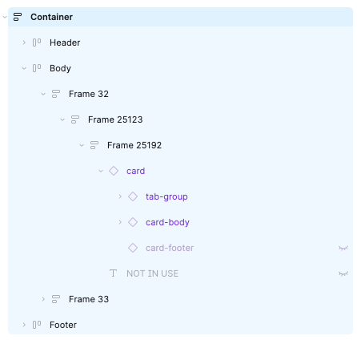
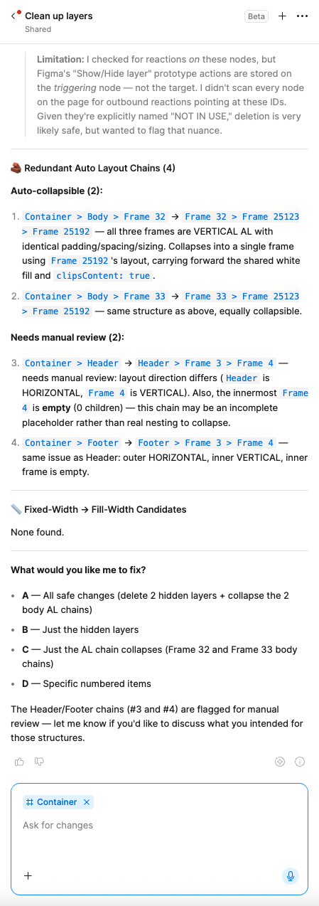
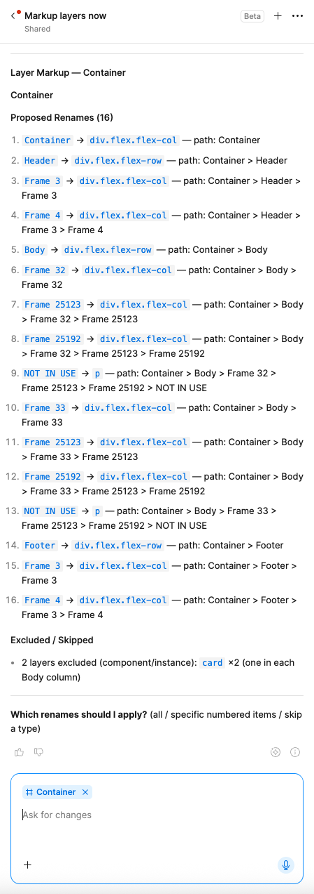

# Figma Agent Skills

A collection of skills for [Figma's AI agent](https://www.figma.com/). Each skill lives in its own folder under `skills/` as a single `SKILL.md` file.

## Installation


1. Open Figma agent.
2. Click the **+** sign in the chat box.
3. Click **Skills**.
4. Click **Add skill**.

5. Select the skill you want to add.

## Skills

| Skill | What it does |
|---|---|
| [`perform-audit`](skills/perform-audit/SKILL.md) | Audits the selected Figma screens and delivers a structured UX report — usability, UI pattern fit, and content quality with every issue prioritised by severity. |
| [`clean-layers`](skills/clean-layers/SKILL.md) | Scans the selected frame(s) for structural cleanup opportunities — deletable hidden layers, redundant auto layout wrappers, fixed-width layers that should be fill-width — and reports every finding before changing anything. |
| [`markup-layers`](skills/markup-layers/SKILL.md) | Renames layers in the selected frame(s) so the layer panel mirrors a pseudo-code/markup structure (e.g. `div.flex.flex-row`, `p`, `svg`), and confirms every proposed rename before applying it. |


## `clean-layers` and `markup-layers`

Structured layers enable better design-to-code workflows. These are query-then-mutation skills: they always report their findings or proposed changes first and only modify the file after you confirm what to apply.

Here's an example of a layer panel with hidden layers and redundant auto layout wrappers:



### `clean-layers` in action

`clean-layers` reports every finding, grouped by category, before applying anything:



### `markup-layers` in action

`markup-layers` proposes a full set of renames mirroring a markup structure, and asks which to apply before touching the layer panel:




## Structure

```
skills/
  <skill-name>/
    SKILL.md
assets/
  *.png   (README screenshots only — not part of any skill)
```

Each `SKILL.md` is self-contained — there are no cross-references between skills or external dependencies. Add a skill on its own; you don't need the others installed for it to work.

## License

[MIT](LICENSE)
